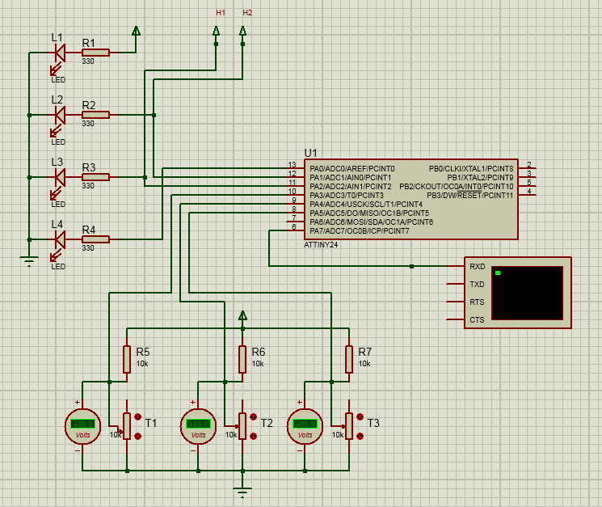

# диференційний термостат

-- задача вмикати\вимикати насос, коли температура на одномому датчику буде вища ніж на другому.  

Схема:  

### Ключові нерівності:

С - 10 >= Б => H1.On   
Б + 10 > C  => H1.Off  
 
K - 10 >= Б => H2.On   
Б + 10 > K  => H2.Off  
 
Б >= 62 => Lock.On  => H1.Off; H2.Off;  
Б <= 58 => Lock.Off                     
  

### Позначення:
* T1 = К - Температура котла.
* Т2 = Б - Температура бойлера.
* Т3 = С - Температура зовнішнього нагрівача.
* Н1 - Насос №1, який качає воду від зовнішньоно нагрівача до бойлера.
* Н2 - Насос №2, який качає воду від котла до бойлера.
* L1 - Контроль живлення.
* L2 - Контроль Н2
* L3 - Контроль Н1
* L4 - Контроль бойлера, вмикаєтся при (Б >= 62)
