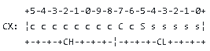

# Преривання 13, робота с диском.

BIOS надає номер диску у DL з якого було завантажено программу.

<table>
  <tr>
    <th>Номер функції у AH</th>
    <th>Опис</th>
    <th>Вхід данних</th>
    <th>Вихід данних</th>
  </tr>
  <tr>
    <th>00</th>
    <th>Скидання пристрою. викликає рекалібрацію контролера.</th>
    <th>DL - номер диску</th>
    <th></th>
  </tr>
  <tr>
    <th>01</th>
    <th>дати статус помилки останньої операції.</th>
    <th>DL - номер диску</th>
    <th>AL містить код помилки диска (те, що значення за адресою 0:0441)</th>
  </tr>
  <tr>
    <th>02</th>
    <th>Читати сектор</th>
    <th>DL = номер диска (0=дискета; 80H=тв.диск 0; 81H=тв.диск 1) 
        DH = номер головки читання/запису 
        CH = номер доріжки (циліндра)(від 0) 
        CL = номер сектора (від 1) 
        AL = число секторів (у сумі не більше одного циліндра) 
        ES:BX => адреса буфера зухвалої програми 
        0:0078 => таблиця параметрів дискети (для гнучких дисків) 
        0:0104 => таблиця параметрів тв.диска (для жорстких дисків) 
 
        Увага! Номери циліндра та сектора не росподілено порівну:  

                Увага! Початок номера циліндра починається у CL з 7 біта, продовжується у CH.
                       Та номер сектора починається у CL з 5 біта.</th>
    <th>Вихід данних</th>
  </tr>
</table>
